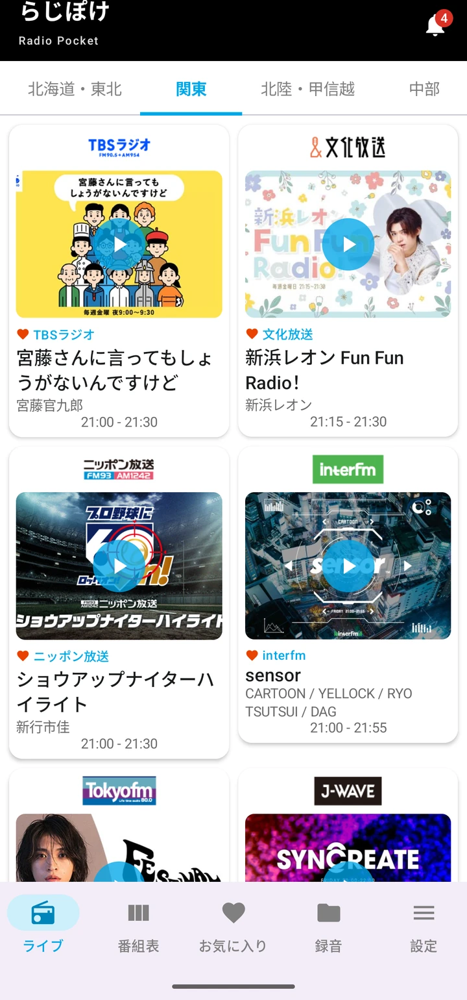
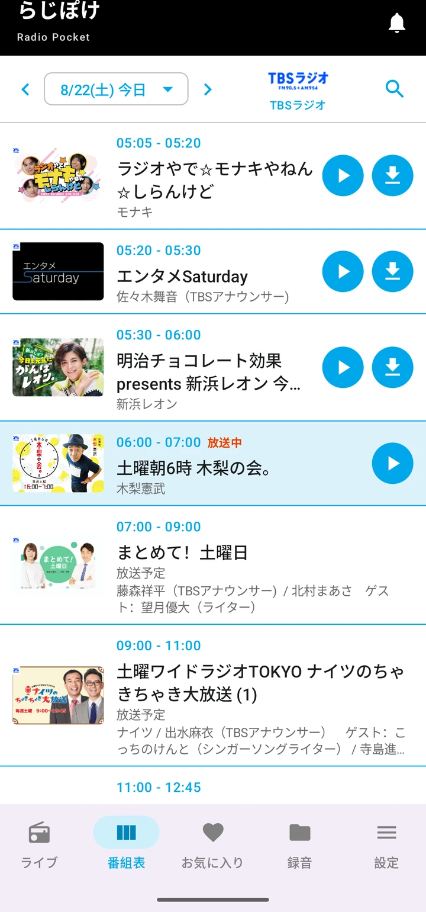
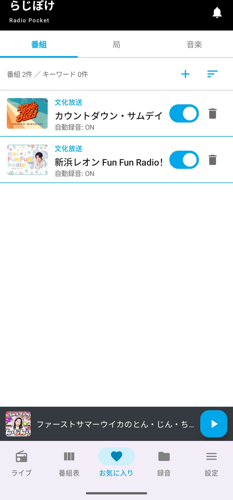
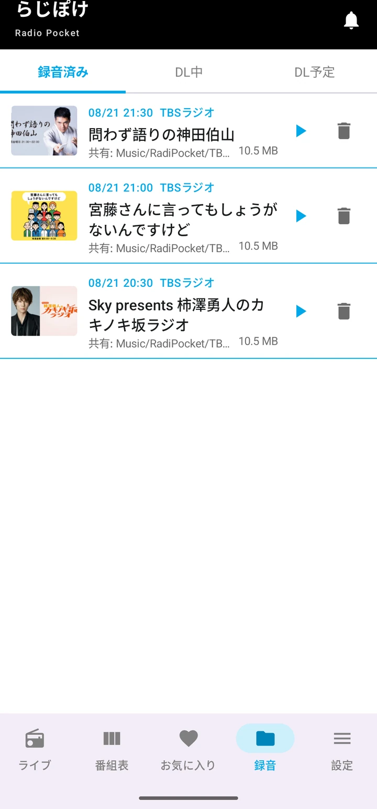
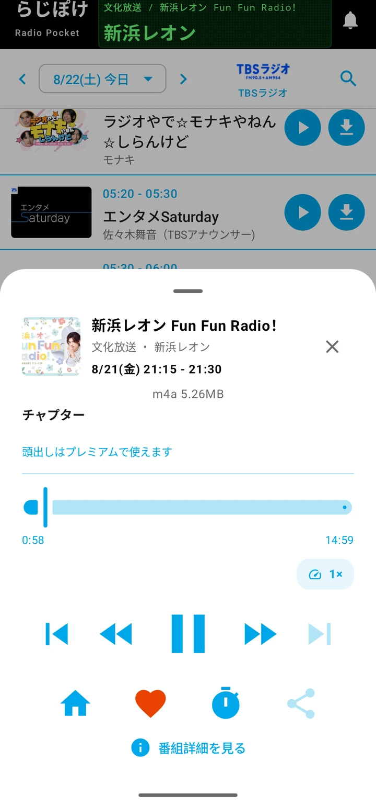
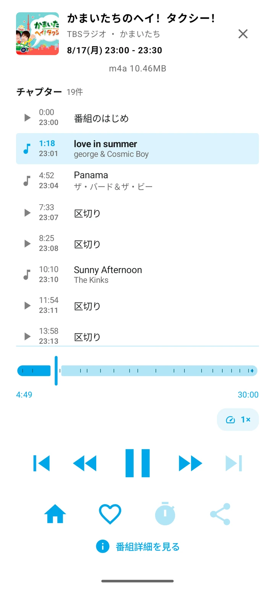

# らじぽけ

Android 向けのラジオ録音アプリです。

radiko で配信されている放送を、いま流れているところからでも、放送が終わったあとからでも聴けます。番組はそのまま端末に録音でき、電波の届かないところでも、あとから好きなときに再生できます。お気に入りに入れた番組は、放送のたびに自動で録音します。

Android 6.0 以降で動きます。

## 画面

### 今やっている放送を聴く

局を選ぶと、すぐに再生が始まります。再生中は通知やロック画面からも操作できます。

### 番組を探す

1週間ぶんの番組表から番組を選べます。放送が終わった番組は、その場で再生することも、録音として端末に残すこともできます。番組名や出演者からの検索もできます。

### 自動で録る

お気に入りに入れた番組は、放送のたびに自動で録音します。番組ごとに切り替えられるので、録りたいものだけを録れます。

### 録れたものが並ぶ

録音した番組は一覧に並びます。保存先はアプリ内と共有ストレージから選べます。共有ストレージに置けば、ほかの音楽アプリからも開けます。

### あとで聴く

再生速度の変更、スリープタイマー、少し戻す・少し進める、といった操作ができます。聴いていた位置は番組ごとに覚えているので、続きから再生できます。

### 頭出しで聴く

録音した番組を無音のところで区切り、章として並べます。聴きたいところから始められます。

## 料金について

一部の機能については、将来的に有料プランを予定しています。

## クローズドテスト

現在、Google Play でクローズドテストを行っています。**テスターを募集しています。** 参加の手順は [クローズドテストのご案内](test.html) をご覧ください。

## ご注意

らじぽけは、**radiko の公式アプリではありません。** radiko を運営する会社とは関係がなく、個人が開発しているアプリです。radiko の名称、および番組・放送局に関する権利は、それぞれの権利者に帰属します。

録音した番組は、私的に楽しむ範囲でご利用ください。

## お問い合わせ

**らじぽけ開発チーム**

- メール: radiopocket.jp@gmail.com
- X: https://x.com/radiopocketjp
- note: https://note.com/radiopocket

---

[ホーム](index.html) ・ [クローズドテスト](test.html) ・ [プライバシーポリシー](privacy-policy.html) ・ [開発ロードマップ](roadmap.html) ・ [変更履歴](changelog.html)
